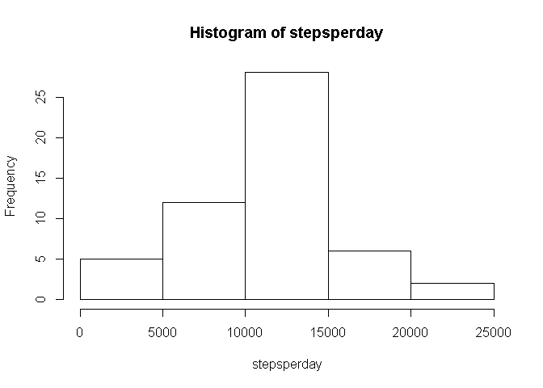
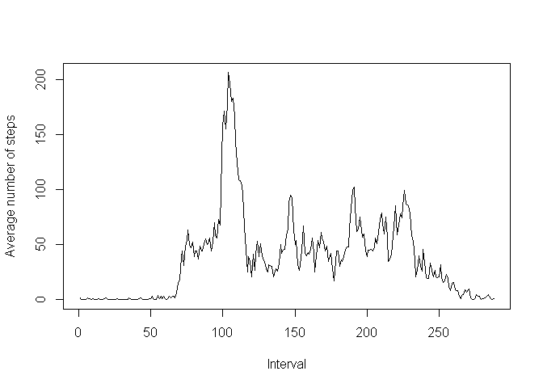
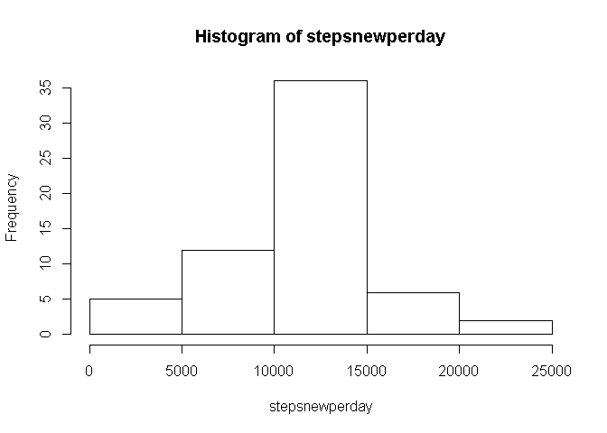
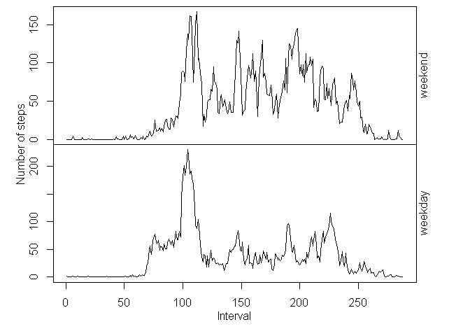

Peer Assessment 1 for Reproducible Research
========================================================
##Loading and preprocessing the data


```r
dat1 <- read.csv("activity.csv")
```

##Mean total number of steps taken per day


```r
stepsperday <- tapply(dat1$steps, dat1$date, sum)
hist(stepsperday)
```

 

```r
round(mean(stepsperday, na.rm= TRUE))
```

```
## [1] 10766
```

```r
median(stepsperday, na.rm= TRUE)
```

```
## [1] 10765
```

##Average daily activity pattern


```r
dat2 <- cbind(dat1, linterval = factor(unique(dat1$interval)))
stepsaverage <- round(tapply(dat2$steps, dat2$linterval, mean, na.rm = TRUE))
plot(stepsaverage, type = "l", xlab = "Interval", ylab = "Average number of steps")
```

 

```r
# The following 5-minute interval contains maximum number of steps
dat2$interval[max(stepsaverage)]
```

```
## [1] 1705
```

##Imputing missing values

###1. Calculate and report the total number of missing values in the dataset (Number of rows with NAs)


```r
nrow(dat1) - sum(complete.cases(dat1))
```

```
## [1] 2304
```

###2. Strategy for filling in all of the missing values in the dataset
We use the mean for the 5-minute interval to fill in all the NA.
Firstly we add a column ("stepsaverage") of data of "the average of 5-minute interval across all the days"
Secondly we replace every NA in the "steps" column with the corresponding data in the "stepsaverage" column
Finally we generate a new dataframe "datnew".

###3. Create a new dataset "datnew" that is equal to the original dataset but with the missing data filled in

```r
stepsnew <- cbind(steps = dat1$steps, stepsaverage = stepsaverage)
dat3 <- cbind(dat1, stepsaverage = stepsnew[, 2])
for (i in 1 : nrow(dat3)) {
  if(is.na(dat3$steps[i])) {dat3$steps[i] <- dat3$stepsaverage[i]}
  }
datnew <- dat3[1:3]
```
###4. Make a histogram of the total number of steps taken each day and Calculate and report the mean and median total number of steps taken per day.

```r
stepsnewperday <- tapply(datnew$steps, datnew$date, sum)
hist(stepsnewperday)
```

 

```r
round(mean(stepsnewperday, na.rm= TRUE))
```

```
## [1] 10766
```

```r
median(stepsnewperday, na.rm= TRUE)
```

```
## [1] 10762
```

These values are different from the estimates from the first part of the assignment.
But the differences are less than 0.001, so the impact of imputing missing data on the estimates of the total daily number of steps is not significant in this example.

```r
(mean(stepsnewperday, na.rm= TRUE) - mean(stepsperday, na.rm = TRUE)) / mean(stepsperday, na.rm = TRUE)
```

```
## [1] -5.102409e-05
```

```r
(median(stepsnewperday, na.rm= TRUE) - median(stepsperday, na.rm = TRUE)) / median(stepsperday, na.rm = TRUE)
```

```
## [1] -0.0002786809
```

##Comparing activity patterns between weekdays and weekends


```r
# 1. Create a new factor variable in the dataset with two levels - "weekday" and "weekend" indicating whether a given date is a weekday or weekend day.

datenew <- weekdays(as.Date(datnew$date, "%Y-%m-%d"))
for (i in 1 : length(datenew)) {
  if((datenew[i] == "Saturday") | (datenew[i] == "Sunday")) datenew[i] <- "weekend"
  else datenew[i] <- "weekday"
  }
datnew$day <- factor(datenew)

# 2. Panel plot
datnew$linterval <- factor(unique(datnew$interval))
datweekday <- subset(datnew, day == "weekday")
stepsaverageweekday <- round(tapply(datweekday$steps, datweekday$linterval, mean, na.rm = TRUE))
datweekend <- subset(datnew, day == "weekend")
stepsaverageweekend <- round(tapply(datweekend$steps, datweekend$linterval, mean, na.rm = TRUE))

par(mfrow = c(2, 1), mar = c(0,0,0,0), oma = c(4, 4, 0.5, 4))
plot(stepsaverageweekend, type = "l", xaxt = "n")
mtext(c("weekend"), side = 4)
plot(stepsaverageweekday, type = "l")
mtext("weekday", side = 4)
mtext("Interval", side = 1, outer = TRUE, line = 2)
mtext("Number of steps", side = 2, outer = TRUE, line =2)
```

 

So we can see from the above plot that the activity patterns between weekdays and weekends are quite different.
