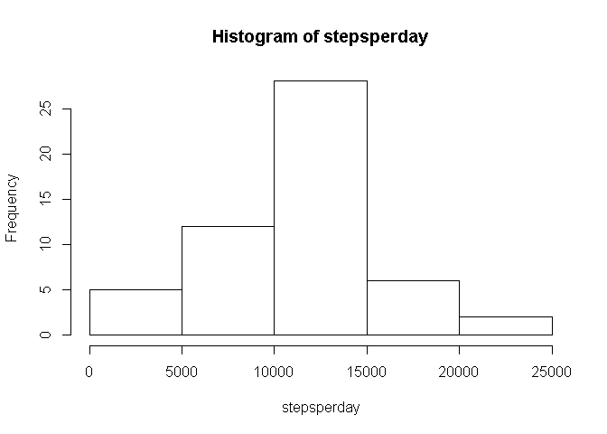
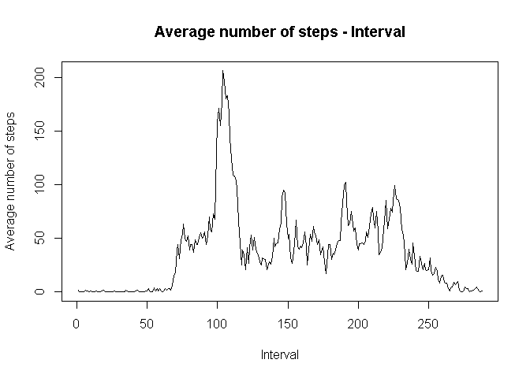
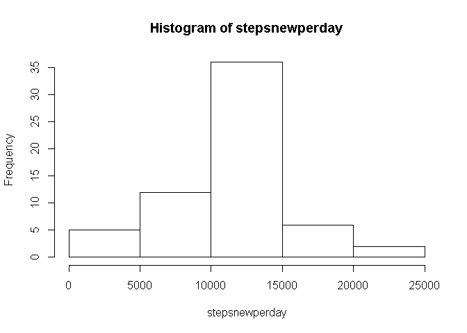
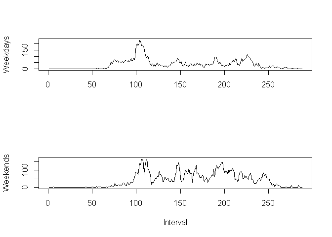

Assignment 1 for Reproducible Research
========================================================
## Loading and preprocessing the data


```r
dat1 <- read.csv("activity.csv")
```

## Mean total number of steps taken per day


```r
stepsperday <- tapply(dat1$steps, dat1$date, sum)
hist(stepsperday)
```

 

```r
round(mean(stepsperday, na.rm= TRUE))
```

```
## [1] 10766
```

```r
median(stepsperday, na.rm= TRUE)
```

```
## [1] 10765
```

## Average daily activity pattern


```r
dat1$linterval <- factor(unique(dat1$interval))
stepsaverage <- round(tapply(dat1$steps, dat1$linterval, mean, na.rm = TRUE))
plot(stepsaverage, type = "l", main ="Average number of steps - Interval",
     xlab = "Interval", ylab = "Average number of steps"
     )
```

 

```r
# The following 5-minute interval contains maximum number of steps
dat1$interval[max(stepsaverage)]
```

```
## [1] 1705
```

## Imputing missing values


```r
# 1. Calculate and report the total number of missing values in the dataset (Number of rows with NAs)
nrow(dat1) - sum(complete.cases(dat1))
```

```
## [1] 2304
```

```r
# 2. Using mean for that 5-minute interval to fill in all the NA
stepsnew <- cbind(steps = dat1$steps, stepsaverage = stepsaverage)
dat2 <- cbind(dat1, stepsaverage = stepsnew[, 2])
for (i in 1 : nrow(dat2)) {
  if(is.na(dat2$steps[i])) {dat2$steps[i] <- dat2$stepsaverage[i]}
  }

# 3. Create a new dataset that is equal to the original dataset but with the missing data filled in
datnew <- dat2[1:3]

# 4. Make a histogram of the total number of steps taken each day and Calculate and report the mean and median total number of steps taken per day.
stepsnewperday <- tapply(datnew$steps, datnew$date, sum)
hist(stepsnewperday)
```

 

```r
round(mean(stepsnewperday, na.rm= TRUE))
```

```
## [1] 10766
```

```r
median(stepsnewperday, na.rm= TRUE)
```

```
## [1] 10762
```

```r
# These values are different from the estimates from the first part of the assignment.
# But the differences are less than 0.001, so the impact of imputing missing data on the estimates of the total daily number of steps is not significant in this example.
(round(mean(stepsnewperday, na.rm= TRUE))-round(mean(stepsperday, na.rm= TRUE)))/round(mean(stepsperday, na.rm= TRUE))
```

```
## [1] 0
```

```r
(mean(stepsnewperday, na.rm= TRUE)-mean(stepsperday, na.rm= TRUE))/mean(stepsperday, na.rm= TRUE)
```

```
## [1] -5.102409e-05
```

```r
(round(median(stepsnewperday, na.rm= TRUE))-round(median(stepsperday, na.rm= TRUE)))/round(median(stepsperday, na.rm= TRUE))
```

```
## [1] -0.0002786809
```

## Comparing activity patterns between weekdays and weekends?


```r
# 1. Create a new factor variable in the dataset with two levels - "weekday" and "weekend" indicating whether #a given date is a weekday or weekend day.

ldate <- weekdays(as.Date(datnew$date, "%Y-%m-%d"))
for (i in 1 : length(ldate)) {
  if((ldate[i] == "Saturday") | (ldate[i] == "Sunday")) ldate[i] <- "weekend"
  else ldate[i] <- "weekday"
  }
datnew$ldate <- factor(ldate)

# 2. plot
datnew$linterval <- factor(unique(datnew$interval))
datweekday <- subset(datnew, ldate == "weekday")
stepsaverageweekday <- round(tapply(datweekday$steps, datweekday$linterval, mean, na.rm = TRUE))
datweekend <- subset(datnew, ldate == "weekend")
stepsaverageweekend <- round(tapply(datweekend$steps, datweekend$linterval, mean, na.rm = TRUE))
par(mfrow = c(2, 1))
plot(stepsaverageweekday, type = "l", xlab = "", ylab = "Weekdays")
plot(stepsaverageweekend, type = "l", xlab = "Interval", ylab = "Weekends")
```

 
